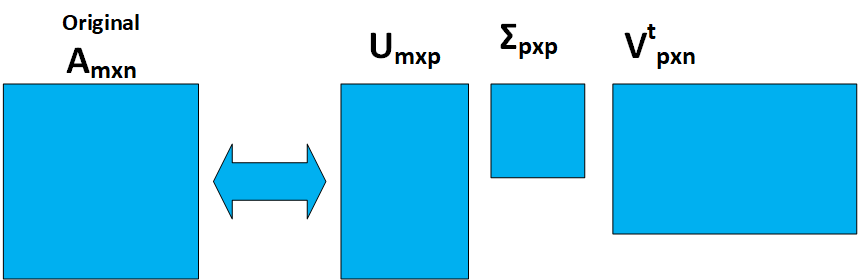
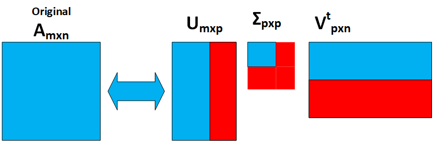

```{r setup, include=FALSE}
knitr::opts_chunk$set(echo = TRUE)
```
******
# Introducción
******
## Presentación
Esta práctica cubre de forma transversal la asignatura.

Las Prácticas 1 y 2 de la asignatura se plantean de una forma conjunta de modo que la Práctica 2 será continuación de la 1.

El objetivo global de las dos prácticas consiste en seleccionar uno o varios juegos de datos, realizar las tareas de **preparación y análisis exploratorio** con el objetivo de disponer de datos listos para **aplicar algoritmos** de clustering, asociación y clasificación.

## Competencias
Las competencias que se trabajan en esta prueba son:  

* Uso y aplicación de las TIC en el ámbito académico y profesional.
* Capacidad para innovar y generar nuevas ideas.
* Capacidad para evaluar soluciones tecnológicas y elaborar propuestas de proyectos teniendo en cuenta los recursos, las alternativas disponibles y las condiciones de mercado.
* Conocer las tecnologías de comunicaciones actuales y emergentes así como saberlas aplicar convenientemente para diseñar y desarrollar soluciones basadas en sistemas y tecnologías de la información.
* Aplicación de las técnicas específicas de ingeniería del software en las diferentes etapas del ciclo de vida de un proyecto.
* Capacidad para aplicar las técnicas específicas de tratamiento, almacenamiento y administración de datos.
* Capacidad para proponer y evaluar diferentes alternativas tecnológicas para resolver un problema concreto.

## Objetivos
La correcta asimilación de todos los aspectos trabajados durante el semestre.  
En esta práctica abordamos un caso real de minería de datos donde tenemos que poner en juego todos los conceptos trabajados.
Hay que trabajar todo el ciclo de vida del proyecto. Desde el objetivo del proyecto hasta la implementación del conocimiento encontrado pasando por la preparación, limpieza de los datos, conocimiento de los datos, generación del modelo, interpretación y evaluación.

## Descripción de la PRA a realizar

## Recursos Básicos
Material docente proporcionado por la UOC. 

## Criterios de valoración

**Ejercicios prácticos** 

Para todas las PRA es **necesario documentar** en cada apartado del ejercicio práctico que se ha hecho y como se ha hecho.

## Formato y fecha de entrega PRA_1
El formato de entrega es: usernameestudiant-PRAn.html/doc/docx/odt/pdf  
Fecha de entrega: 02/12/2020  
Se debe entregar la PRA_1 en el buzón de entregas del aula  

## Nota: Propiedad intelectual 

> A menudo es inevitable, al producir una obra multimedia, hacer uso de recursos creados por terceras personas. Es por lo tanto comprensible hacerlo en el marco de una práctica de los estudios de Informática, Multimedia y Telecomunicación de la UOC, siempre y cuando esto se documente claramente y no suponga plagio en la práctica. 

> Por lo tanto, al presentar una práctica que haga uso de recursos ajenos, se debe presentar junto con ella un documento en que se detallen todos ellos, especificando el nombre de cada recurso, su autor, el lugar donde se obtuvo y su estatus legal: si la obra esta protegida por el copyright o se acoge a alguna otra licencia de uso (Creative Commons, licencia GNU, GPL ...). 
El estudiante deberá asegurarse de que la licencia no impide específicamente su uso en el marco de la práctica. En caso de no encontrar la información correspondiente tendrá que asumir que la obra esta protegida por copyright. 

> Deberéis, además, adjuntar los ficheros originales cuando las obras utilizadas sean digitales, y su código fuente si corresponde.  

******
# Enunciado
******
Todo estudio analítico debe nacer de una necesidad por parte del **negocio** o de una voluntad de dotarle de un conocimiento contenido en los datos y que solo podremos obtener a través de una colección de buenas prácticas basadas en la Minería de Datos.  

El mundo de la analítica de datos se sustenta en 3 ejes:  

1. Uno de ellos es el profundo **conocimiento** que deberíamos tener **del negocio** al que tratamos de dar respuestas mediante los estudios analíticos.  

2. El otro gran eje es sin duda las **capacidades analíticas** que seamos capaces de desplegar y en este sentido, las dos prácticas de esta asignatura pretenden que el estudiante realice un recorrido sólido por este segundo eje.  

3. El tercer eje son los **Datos**. Las necesidades del Negocio deben concretarse con preguntas analíticas que a su vez sean viables responder a partir de los datos de que disponemos. La tarea de analizar los datos es sin duda importante, pero la tarea de identificarlos y obtenerlos va a ser para un analista un reto permanente.  

Como **primera parte** del estudio analítico que nos disponemos a realizar, se pide al estudiante que complete los siguientes pasos:   

1. Seleccionar un juego de datos y justificar su elección. El juego de datos deberá tener capacidades para que se le puedan aplicar algoritmos supervisados, algoritmos no supervisados y reglas de asociación.   

2. Realizar un análisis exploratorio del juego de datos seleccionado.   

3. Realizar tareas de limpieza y acondicionado para poder ser usado en procesos de modelado.

4. Realizar métodos de discretización

5. Aplicar un estudio PCA sobre el juego de datos. A pesar de no estar explicado en el material didáctico, se valorará si en lugar de PCA investigáis por vuestra cuenta y aplicáis SVD (Single Value Decomposition).

******
# Solución
******

## Introducción

En esta práctica se realizará una simulación de un proyecto real de minería de datos. El juego de datos seleccionado será la base para recorrer todo el ciclo de vida del proyecto, pasando por la limpieza y preparación de los datos hasta la obtención del conocimiento, resultado obtenido de la aplicación de los diferentes algoritmos de ML. 

En esta primera parte, solamente se realizarán las tares relacionadas con la preparación de los datos, aplicando las diferentes técnicas estudiadas en clase, tales como la normalización, la discretización y el tratamiento de _outliers_ y _missing data_. De manera que manera los datos quedarán listos para que en la segunda parte de la práctica se le puedan aplicar los diferentes algoritmos. En esta práctica también se aplicará una técnica de reducción de dimensionalidad al _dataset_ SVD (_Single Value Decomposition _ ), esto como resultado de la investigación autodidacta de este tipo de técnicas. 


## Elección del _dataset_

Para elegir el conjunto de datos se ha consultado la plataforma [Kaggle](https://www.kaggle.com/), de la que se ha seleccionado el conjunto de datos  [_Pima Indians Diabetes Database_](https://www.kaggle.com/uciml/pima-indians-diabetes-database). 

Este conjunto de datos contiene información relacionada con pacientes del " _National Institute of Diabetes and Digestive and Kidney Diseases_ " de los Estados Unidos, en el se recogen valores de algunas variables médicas con el objetivo de predecir si una persona tiene o no Diabetes, según la descripción del conjunto de datos la mayoría de los pacientes son mujeres mayores de 21 años. A continuación se describen cada una de estas variables predictoras y la variable objetivo.

*Pregnancies: Número de veces que estuvo embarazada.
*Glucose: Concentración de Glucosa en sangre.
*BloodPressure: Presión arterial diastólica.
*SkinThickness: Espesor del pliegue cutáneo del _tríceps_.
*Insulin: Nivel de Insulina sérica de 2 horas. 
*BMI: ïndice de masa corporal.
*DiabetesPedigreeFunction: Función del pedigrí de la diabetes.
*Age: Edad del paciente.
*Outcome: variable objetivo, está formada por dos clases, "0" => "Diabetic" .... "1" => "Healthy"

Este juego de datos ha sido seleccionado después de realizar una larga búsqueda por varios de los repositorios de datos abiertos, su elección está principalmente fundamentada por las capacidades analíticas que se intuyen de los datos y porque cumple a la perfección con los requerimientos indicados en la orientación de la práctica. A este juego de datos se le pueden aplicar algoritmos supervisados, no supervisados y reglas de asociación, y los datos están en un formato que facilitan estas tareas. 

## Carga de los Datos. 

A continuación se procede a la carga de los datos, el _dataset_ fue previamente descargado al entorno local y colocado en el directorio _data_, que cuelga del directorio principal del proyecto. También se obtendrá una vista panorámica de los datos, principalmente para comprobar el formato de estos, su tamaño y su dimensionalidad.


```{r message=FALSE,warning=FALSE}
library(plotly)

# Loading the data file.
diabetes.raw <- read.csv("./data/diabetes.csv", header = TRUE)


```


## Visión General del Dataset.

Para tener una primera idea de como está conformado el _dataset_ es necesario realizar una primera exploración de sus características generales, a continuación se efectúa este primer análisis.

```{r message=FALSE,warning=FALSE}
# Getting the structure of the data set.
str(diabetes.raw)

# Looking basics info of the attributes. 
summary(diabetes.raw)

# Looking a panoramic view of the data.
head(diabetes.raw)

```

### Visualización general del Dataset.

Antes de proceder a manipular los datos se realiza un análisis visual de las variables predictoras del conjunto de datos. Como los datos están en formato numérico se utilizan histogramas para representarlos, el objetivo de este análisis es complementar el análisis realizado anteriormente en el que se observaron las principales características de los datos, tales como: formato, dimensionalidad y tipo.

La función _visual_analy()_ se encarga de crear la representación visual de todas las variables a la ves, esta función será utilizada en varios puntos del proyecto para comprobar el estado de los datos.

```{r message=FALSE, warning=FALSE}

visual_analy <- function(df){
# Create a empty list for plots.
plot_lys <- list()

# Get the names of all varibales in the raw data set.
names <- colnames(df[1:8])

# Fill a plots's list with plot_ly histograms.
for (i in 1:length(names)){
  
  fig <- plot_ly(x = df[,i],
                 type = "histogram",
                 histnorm = "count",
                 name = names[i])
  
  plot_lys[[i]] <- fig
}

# Create a subplot with each plot in the list.
repres <- subplot(plot_lys, nrows = 2)
repres

}

```

Inicialmente se realiza el análisis visual a los datos originales. 

```{r message=FALSE, warning=FALSE}

# Visual Analysis
visual_analy(diabetes.raw)


```
### Conclusiones del análisis inicial.

De este primer análisis se obtienen las siguientes conclusiones.

* Se aprecia que contiene 768 observaciones de las 9 variables descritas anteriormente.
* Los datos están en formato numérico, la mayoría son de tipo **int** a excepción de los valores de **BMI** y de **DiabetesPedigreeFunction** que son de tipo **num**.
* Los valores están en diferentes escalas, por ejemplo entre los valores de la edad ( _age_ ) y los del nivel de glucosa en sangre ( _Glucose_ ) hay una diferencia significativa. 
* Se aprecian algunos valores "cero" en los datos, algunos de ellos parecen ser _outliers_.


## Preparación y Limpieza de los datos

En este apartado se realizarán todas las modificaciones necesarias para mejorar la calidad de los datos, poniendo especial interés en el tratamiento a los valores ausentes y a los valores extremos.

El primer paso que se realiza es crear una copia de los datos originales, en esta copia se almacenan los datos durante todo el proceso de preparación y limpieza. 

```{r message=FALSE, warning=FALSE}

# Create a copy for cleaned data
diabetes.cl <- diabetes.raw

```


### Valores Extremos " _outliers_ ".

De la gráfica mostrada en el apartado de **Visualicación Inicial del Datset** se intuye que existen algunos valores que pueden ser clasificados como _outliers_, como por ejemplo el valor de una paciente que muestra que estuvo embarazada 17 veces, o los valores del índice de masa corporal cercano a cero, estos valores a simple vista parecen extraños con respecto a los valores de su muestra. Por este motivo será necesario realizar un análisis de cada una de las variables que componen el _dataset_ para detectar los valores extremos y tratarlos según convenga.

Para facilitar el trabajo en la búsqueda de _outliers_ se crea la función _check_values()_, que recibirá como parámetro la variable que se desea analizar y devuelve un gráfico _Box Plot_ y los valores de los posibles _outlilers_.

En cada caja de gráfico se muestra la siguiente información estadística de cada variable:

*Mediana: Valor medio del _dataset_ (Q2/50th Percentile).
*Primer Quartil: Valor medio entre el valor mínimo y la mediana (Q1/25th Percentile).
*Tercer Quartil: Valor medio entre la mediana y el valor mácimo (Q3/75th Percentile).
*InterQuartil: (IQR): Rango entre el Q1 y el Q3, determina cuan separados están los valores centrales del _dataset_.
*Valor máximo: Q3 + 1.5xIQR
*Valor Mínimo: Q1 -1.5xIQR
*Outliers: Se ubican por fuera de los límites de los _wiskers_.

Además de esta información, el gráfico se divide en cuatro partes más, mostrando una caja con información referente a los siguientes tipos.

* Todos los puntos de la variable.
* Solo los _Wiskers_.
* Solo los posibles _outiliers_.
* _Wiskers_ y _outliers_.


```{r message=FALSE, warning=FALSE}

check_values <- function(feature){

fig <- plot_ly(type = 'box')
fig <- fig %>% add_boxplot(y = feature,
                           jitter = 0.3, 
                           pointpos = -1.8, 
                           boxpoints = 'all',
                           marker = list(color = 'rgb(7,40,89)'),
                           line = list(color = 'rgb(7,40,89)'),
                           name = "All Points")

fig <- fig %>% add_boxplot(y = feature, 
                           name = "Only Whiskers", 
                           boxpoints = FALSE,
                           marker = list(color = 'rgb(9,56,125)'),
                           line = list(color = 'rgb(9,56,125)'))

fig <- fig %>% add_boxplot(y = feature, 
                           name = "Suspected Outlier",
                           boxpoints = 'suspectedoutliers',
                           marker = list(color = 'rgb(8,81,156)',
                           outliercolor = 'rgba(219, 64, 82, 0.6)',
                           line = list(outliercolor = 'rgba(219, 64, 82, 1.0)',
                                        outlierwidth = 2)),
                           line = list(color = 'rgb(8,81,156)'))

fig <- fig %>% add_boxplot(y = feature,
                           name = "Whiskers and Outliers", 
                           boxpoints = 'outliers',
                           marker = list(color = 'rgb(107,174,214)'),
                           line = list(color = 'rgb(107,174,214)'))

fig <- fig %>% layout(title = "Box Plot Indentifying Outliers")

# Get the posibles outliers.
outliers <- boxplot.stats(feature)$out


return(list(fig=fig,out=outliers))
}

```


Se efectúa la búsqueda de _outliers_ en cada una de las variables del _dataset_. En los casos en los que se considera necesario se eliminan los registros del conjunto de datos.

#### Pregnancies


```{r message=FALSE, warning=FALSE}

# Get the results of the analysis.
values = check_values(diabetes.cl$Pregnancies)

# Boxplot figure
values$fig

# Oultiers
print("Posibles Valores Extremos")
values$out

# Deletting the outliers.
diabetes.cl <- diabetes.cl[-which(diabetes.cl$Pregnancies %in% values$out),]

# Check the result of deletting proccess.
check_values(diabetes.cl$Pregnancies)

```

#### Glucose

```{r message=FALSE,warning=FALSE}

# Get the results of the analysis.
values = check_values(diabetes.cl$Glucose)

# Boxplot figure
values$fig

# Oultiers
print("Posibles Valores Extremos")
values$out


```
En los valores de la glucosa no se detectan _outliers_.

#### BloodPressure

```{r message=FALSE, warning=FALSE}

# Get the results of the analysis.
values = check_values(diabetes.cl$BloodPressure)

# Boxplot figure
values$fig

# Oultiers
print("Posibles Valores Extremos")
values$out

# Deletting the outliers.
diabetes.cl <- diabetes.cl[-which(diabetes.cl$BloodPressure %in% values$out),]

# Check the result of deletting proccess.
check_values(diabetes.cl$BloodPressure)


```

#### SkinThickness

```{r message=FALSE, warning=FALSE}

# Get the results of the analysis.
values = check_values(diabetes.cl$SkinThickness)

# Boxplot figure
values$fig

# Oultiers
print("Posibles Valores Extremos")
values$out

# Deletting the outliers.
diabetes.cl <- diabetes.cl[-which(diabetes.cl$SkinThickness %in% values$out),]

# Check the result of deletting proccess.
check_values(diabetes.cl$SkinThickness)


```

#### Insulin

```{r message=FALSE,warning=FALSE}

# Get the results of the analysis.
values = check_values(diabetes.cl$Insulin)

# Boxplot figure
values$fig

# Oultiers
print("Posibles Valores Extremos")
values$out

# Deletting the outliers.
diabetes.cl <- diabetes.cl[-which(diabetes.cl$Insulin %in% values$out),]

# Check the result of deletting proccess.
check_values(diabetes.cl$Insulin)

```

#### BMI

```{r message=FALSE,warning=FALSE}

# Get the results of the analysis.
values = check_values(diabetes.cl$BMI)

# Boxplot figure
values$fig

# Oultiers
print("Posibles Valores Extremos")
values$out

# Deletting the outliers.
diabetes.cl <- diabetes.cl[-which(diabetes.cl$BMI %in% values$out),]

# Check the result of deletting proccess.
check_values(diabetes.cl$BMI)

```

#### DiabetesPedigreeFunction

```{r message=FALSE, warning=FALSE}

# Get the results of the analysis.
values = check_values(diabetes.cl$DiabetesPedigreeFunction)

# Boxplot figure
values$fig

# Oultiers
print("Posibles Valores Extremos")
values$out

# Deletting the outliers.
diabetes.cl <- diabetes.cl[-which(diabetes.cl$DiabetesPedigreeFunction %in% values$out),]

# Check the result of deletting proccess.
check_values(diabetes.cl$DiabetesPedigreeFunction)

```

#### Age

```{r message=FALSE, warning=FALSE}

# Get the results of the analysis.
values = check_values(diabetes.cl$Age)

# Boxplot figure
values$fig

# Oultiers
print("Posibles Valores Extremos")
values$out

```

En el caso de la edad aunque estadísticamente estos valores sean _outliers_ no se eliminarán porque son edades razonables, es decir, que incluso la edad con valor de 81 años es una edad común entre la población.


### Missing values.

#### Identificación de _missing values_.

De manera similar a la ocurrida con los _oputliers_ en el apartado **Visualicación Inicial del Datset** también se han identificado algunos valores que pueden corresponder a _missing values_. Más específicamente se han detectado una gran cantidad de 0 "ceros" en los datos, principalmente en las variables " _Insulin_" y " _SkinThickness_". 

Al analizar un poco más en profundidad estas variables se detecta que sus valores no pueden ser cero, es imposible que los valores de glucosa de una persona sean cero, o igualmente que los niveles de insulina después de dos horas sea cero, con lo cual estos valores demuestran que corresponden  a valores nulos. Por ende se procede a establecerlos como NaN, para facilitar su posterior tratamiento, destacar que no se sustituyen en todas las variables, ya que en algunas si es posible que el cero sea una medida válida, como por ejemplo en la variable " _Pregnancies_", que indica la cantidad de embarazos de las mujeres.

```{r message=FALSE, warning=FALSE}

# Replace 0s with Nan.
nan_names <- c('Glucose','BloodPressure','SkinThickness','Insulin','BMI')

diabetes.cl[nan_names][diabetes.cl[nan_names] == 0] <- NaN

# Looking a panoramic view of the data.
head(diabetes.cl)


```
#### Tratamiento de los _missing values_.

Para seleccionar la manera más adecuada de tratar los valores ausentes es necesario realizar algunas pruebas, estas pruebas permiten conocer algunas características de estos valores, y al final del proceso los resultados de estas pruebas serán definitorios a la hora de elegir un método para tratar los _missing values_.

Inicialmente se cuentan los _missing values_ por cada variable. Y se calcula el porcentaje que representan estos valores del total de entradas en el conjunto de datos.
```{r message=FALSE, warning=FALSE}

# Amount of NaN values per each column.
colSums(is.na(diabetes.cl))

# Percercent of null values.
perc <- (sum(is.na(diabetes.cl$SkinThickness)))/nrow(diabetes.cl)*100
paste("Porciento de valores nulos en SkinThickness:", round(perc,2))

perc <- (sum(is.na(diabetes.cl$Insulin)))/nrow(diabetes.cl)*100
paste("Porciento de valores nulos en Insulin:", round(perc,2))

```


Como se puede apreciar en el anterior análisis un gran porciento de los datos contiene _missin values_, llegando a alcanzar el 48% en el caso de la variable _Insulin_, con lo cual el método para tratar estos datos debe ser elegido con cuidado. Será necesario continuar con el análisis de estos valores para tomar una decisión.

Partiendo de la base de que la variable _Insulin_ es la que mayor porcentaje de _missing valeus_ tiene, se calcula la proporción de los valores nulos de _SkinThickness_  que también son valores nulos en _Insulin_.

```{r message=FALSE, warning=FALSE}

# Get the matches in null values in both variables.
sum((is.na(diabetes.cl$SkinThickness)) & (is.na(diabetes.cl$Insulin)))

```


El análisis anterior muestra que todos lo valores nulos de la variable  _SkinThickness_ también lo son en la variable _Insulin_, lo que demuestra que estos registros presentan serios problemas. Puede ser porque no fueron tomados por los doctores en el momento de hacer el estudio,o porque solo tomaban las muestras de las personas que pensaban que podían presentar la enfermedad. 

Se evalúan las correlaciones de esta variable con la variable objetivo para ver que influencia tienen estos valores en la predicción.
```{r message=FALSE, warning=FALSE}

# Get the correlation with target variable.
cor.test(diabetes.cl$Insulin, diabetes.raw$Outcome[diabetes.cl$Insulin])

cor.test(diabetes.cl$SkinThickness, diabetes.raw$Outcome[diabetes.cl$SkinThickness])

```
Como se puede apreciar los valores de las correlaciones no son muy altos, con lo cuál estas variables no tienen una gran influencia en la variable objetivo. 

Este hecho ayuda a tomar la decisión de sustituir todos los registros que contengan valores nulos, Se seleccionará el valor de la mediana de cada una de las variables que contengan valores ausentes para la sustitución. 

Inicialmente se había analizado la opción de eliminar estos datos, pero esto trae consigo una pérdida de datos muy significativa para el modelo, ya que hubiese sido necesario eliminar casi el 50% de los datos, y se perdería la capacidad predictora de las demás variables. Es cierto que al sustituir estos valores por los de la mediana se introducen muchos datos al modelo, y esto puede acarrear un sesgo en la información, pero es una solución mejor que la de eliminarlos. Además los datos de las medianas en estos casos son valores que pueden ser considerados normales, ya que corresponden a valores de personas sanas en estas pruebas. 


### Tratando los _missin values_.

Tal y como se había expresado anteriormente, se procede a remplazar los _missing vlaues_ por el valor de la mediana de cada un de sus variables. 

```{r message=FALSE, warning=FALSE}

# Replace the values with the median value.
for(i in 1:ncol(diabetes.cl)){
  diabetes.cl[is.na(diabetes.cl[,i]), i] <- median(diabetes.cl[,i], na.rm = TRUE)
}

# Getting the structure of the data set.
str(diabetes.cl)

# Looking basics info of the attributes. 
summary(diabetes.cl)

# Looking a panoramic view of the data.
head(diabetes.cl)
 
# Percent of losted data.
perc <- 100 - nrow(diabetes.cl)/nrow(diabetes.raw)*100
cat("Porciento de datos perdiddos:", round(perc,2))

```

Obtenemos una visión general de los datos una vez eliminados los _outliers_ y sustituidos los _missing values_. Se puede apreciar que se ha prescindido de más de un 15% de los datos. 


```{r message=FALSE, warning=FALSE}

# Visual Analysis
visual_analy(diabetes.cl)
```
En la gráfica anterior se aprecia como han cambiado las disposiciones de las variables que tenían un número elevado de valores ausentes ( _Insulin_ , _SkinThickness_ ), presentando ahora todos los valores que se han sustituido por la mediana.

## Análisis Exploratorio

 En este apartado se procede a analizar las relaciones de cada una de las variables predictoras con la variable _target_, intentando encontrar patrones o comportamientos que puedan aportar cualquier información sobre el conjunto de datos. También se convertirán los valores de la variable _Outcome_ a categóricos, esta tarea facilitará el posterior uso de la variable _target_ a la hora de analizar las diferentes relaciones entre esta variable y las predictoras.
 
 
Para trabajar en el análisis exploratorio se crea una copia de los datos limpios.

```{r message=FALSE,warning=FALSE}

# Create a copy of the cleaned dataset.
diabetes.exp <- diabetes.cl

diabetes.exp$Outcome[diabetes.exp$Outcome == 1] <- "Healthy"
diabetes.exp$Outcome[diabetes.exp$Outcome == 0] <- "Diabetic"
```
 

### Análisis variable Age.

```{r message=FALSE, warning=FALSE}
library(ggplot2)

# Discretizing age variable
diabetes.exp["Age"] <- cut(diabetes.exp$Age, breaks=c(-Inf,23,35,55,+Inf),
                      labels=c("young","adults","mid-age","old"))


# Looking a panoramic view of the data.
head(diabetes.exp)

x <- table(diabetes.exp$Age,diabetes.exp$Outcome)/nrow(diabetes.exp) * 100
x

# Looking for appearances.
ggplot(data = diabetes.exp,aes(x=Age,fill=Outcome))+geom_bar(binwidth = 3,position="dodge")+ylab("Count") + xlab("Age")


```
Tal y como se puede apreciar en la gráfica, la mayoría de los casos tanto negativos como positivos se encuentran en las personas adultas y de mediana edad.

### Análisis variable Pregnancies.

```{r message=FALSE,warning=FALSE}

# Looking for appearances.
ggplot(data = diabetes.exp,aes(x=Pregnancies,fill=Outcome))+geom_bar(binwidth = 3,position="dodge")+ylab("Count") + xlab("Pregnancies")


```
En la gráfica se aprecia que el las mujeres embarazadas tienen una mayor probabilidad de sufrir diabetes. 

### Análisis variable Glucose.

En este apartado se intentará obtener alguna información de la variable _Glucose_ con respecto a la _Outcome_.
.
```{r message=FALSE,warning=FALSE}

# Looking for appearances.

fig <- plot_ly(x = diabetes.exp$Glucose,
               color = diabetes.exp$Outcome,
               colors =  c("#F35E48", "#7CA6D7"),
               type = "histogram",
               xbins = data.frame(
                 start=min(diabetes.raw$Glucose)-1,
                 end=max(diabetes.raw$Glucose)+1,
                 size=5
                ))
fig

```
En esta gráfica se puede apreciar que la mayoría de casos con resultado positivo al examen de Diabetes tienen valores entre 90 y 120.

### Análisis variable SkinThickness.


```{r message=FALSE,warning=FALSE}

# Looking for appearances.

fig <- plot_ly(x = diabetes.exp$SkinThickness,
               color = diabetes.exp$Outcome,
               colors =  c("#F35E48", "#7CA6D7"),
               type = "histogram",
               xbins = data.frame(
                 start=min(diabetes.exp$SkinThickness)-1,
                 end=max(diabetes.exp$SkinThickness)+1,
                 size=3
                ))
fig

```


### Análisis variable Insulin.

```{r message=FALSE,warning=FALSE}

# Looking for appearances.

fig <- plot_ly(x = diabetes.exp$Insulin,
               color = diabetes.exp$Outcome,
               colors =  c("#F35E48", "#7CA6D7"),
               type = "histogram",
               xbins = data.frame(
                 start=min(diabetes.exp$Insulin)-1,
                 end=max(diabetes.exp$Insulin)+1,
                 size=15
                ))
fig
```


### Análisis variable BMI

```{r message=FALSE,warning=FALSE}

# Looking for appearances.

fig <- plot_ly(x = diabetes.exp$BMI,
               color = diabetes.exp$Outcome,
               colors =  c("#F35E48", "#7CA6D7"),
               type = "histogram",
               xbins = data.frame(
                 start=min(diabetes.exp$BMI)-1,
                 end=max(diabetes.exp$BMI)+1,
                 size=3
                ))
fig
```
Este análisis no muestra relevancias con respecto a la salida, ambas clases (diabéticos y no diabéticos).

### Análisis variable DiabetesPedigreeFunction

```{r message=FALSE,warning=FALSE}

# Looking for appearances.

fig <- plot_ly(x = diabetes.exp$DiabetesPedigreeFunction,
               color = diabetes.exp$Outcome,
               colors =  c("#F35E48", "#7CA6D7"),
               type = "histogram",
               xbins = data.frame(
                 start=min(diabetes.exp$DiabetesPedigreeFunction)-1,
                 end=max(diabetes.exp$DiabetesPedigreeFunction)+1,
                 size=0.5
                ))
fig
```


### Análisis de Correlaciones y Distribuciones.

En este análisis consiste en buscar las correlaciones entre cada una de las variables del _dataset_, tomándolas de dos a dos y construyendo la matriz de correlaciones. También se intentará identificar las diferentes distribuciones de estas gracias a sus histogramas.

Para facilitar esta tarea se usa una poderosa herramienta que permite ver ambas características a la ves, los _pairs plots_. En la diagonal principal de se muestran las distribuciones de las variables, en la mitad inferior se observan los gráficos de densidad y en la parte superior de la figura la matriz de correlación (se utiliza la correlación de _pearson_). 

```{r message=FALSE, warning=FALSE}

library(psych)

pairs.panels(diabetes.exp, 
             method = "pearson", # correlation method
             hist.col = "#00AFBB",
             density = TRUE,  # show density plots
             ellipses = TRUE # show correlation ellipses
)


```


### Conclusiones del análisis exploratorio.

De los resultados obtenidos en el análisis exploratorio se pueden obtener las siguientes conclusiones:

* Las variables _Glucose_, _BloodPressure_ y _BMI_, presentan una distribución normal.
* Las variabels _Pregnancies_, _Insulin_ , _Age_, _DiabetesPedigreeFunction_  están sesgadas a la derecha ( _skewed right_).
* No hay una correlación alta entre ninguno de los parámetros, aunque si se nota que hay cierta relación entre las siguientes variables; _Pregnancies_ - _Age_, _BloodPressure_ - _Age_ y _Insulin_ - _Glucose_.
* Las variables más relacionadas con la variable _target_ son _Glucose_ y _BMI_, las demás presentan una correlación similar y la que menos influencia tiene sobre la variable clase es _DiabetesPedigreeFunction_.
* Las mujeres entre adultas y de mediana edad son las más propensas a tener diabetes, teniendo un porcentaje de aproximadamente el 45% del total de casos registrados.
* Las mujeres despúes de tener hijos son más propensas a padecer esta enfermedad.
* Las personas con altos niveles de insulina, glucosa y tensión son más propensas también a padecer diabetes.

## SVD ( _Singular Value Decomposition_).

En este apartado se aplicará un proceso de SVD al _dataset_ con el que se ha trabajado hasta el momento. El SVD es una de las más poderosas técnicas del Álgebra lineal utilizada para la reducción del tamaño y la dimensionalidad de los datos. Puede ser utilizada en la compresión de imágenes, en la reducción del ruido en los datos o en la elaboración de sistemas de recomendación, entre otras muchas aplicaciones. Las principales empresas tecnológicas de momento utilizan de alguna manera estas técnica, por ejemplo _Netflix_ lo utiliza para sus sistema de recomendación de contenido multimedia, _Amazon_ para recomendar sus productos y _Facebook_ al sus sistemas de reconocimiento facial.

Esta técnica utiliza como base otra de los más utilizados procedimientos para la reducción de la dimensionalidad, PCA ( _Principal Component Analysis_) [@PCA], solo que en lugar de buscar las características principales no correlacionadas en las variables originales, el SVD busca en ambas dimensiones, analizando tanto los registros como las características. A continuación de ofrece una reseña de los fundamentes matemáticos detrás de esta técnica y se aplica al conjunto de datos en cuestión.

### Fundamentos matemáticos.

La técnica de SVD consiste en reducir la matriz original **_$A$_** con _rank_ **_$r$_**, en una matriz más pequeña con _rank_ _k_. Este método es aplicable tanto a matrices cuadradas como a rectangulares, y los valores de las matrices pueden ser reales o complejos, la única restricción es que tienen que ser numéricos ya que utilizan las correlaciones para realizar el análisis.

La reducción se realiza factorizando la matriz **_$A$_** con la forma **_$m$x$n$_** en la multiplicación tres matrices, de la forma **_$A= UΣV^{T}$_**.

{width=500, height=500'}


Donde:
**_$m$_**: La cantidad de variables de la base de datos.

**_$$n$_**: La cantidad de entradas en la base de datos.


**$U$**: Matriz de tamaño **_$m$x$p$_** , cuyas columnas son el resultado de calcular los _eigenvectors_ de la matriz de correlaciones **_$AA^{T}$_**. 

Esta matriz posee las siguientes características:
* Es una matriz ortogonal, tal que ($U^{T}U = UU^{T}=I$).
* En ocasiones se le nombra como _left singular vector_, y contienen información relacionada con las columnas de la matriz $A$.
* Las columnas de $U$ son exactamente iguales a las columnas de $A$, pero están 
jerárquicamente organizadas, de manera que estos _eigenvectors_ describen la varianza de las columnas de $A$. 

**$Σ$**: Matriz diagonal que contiene los valores singulares de $r$, que son calculados como las raíces cuadradas de los _eigeivalues_ distintos de cero de **_$A^{T}A$_** y **_$AA^{T}$_**. Estos valores se pueden identificar como los niveles de la varianza ($\sigma$) de cada uno de los _singular vectors_.

Esta matriz tiene algunas características que le otorgan una gran importancia:

* Los valores de $\sigma$, (en la diagonal principal), están ordenados por importancia, con lo cual la carga de información útil en los primeros elementos será mayor que en los siguientes.
* Independientemente que el tamaño de la matriz sea de **_$p$x$p$_** solo contiene **_$n$_** valores de $\sigma > 0$, que corresponden a los **_$m$_**.

**$V^{T}$**: Es una matriz de tamaño **_$p$x$n$_** , cuyas columnas son el resultado de calcular los _eigenvectors_ de la matriz de correlaciones **_$A^{T}A$_**.

Esta matriz posee las siguientes características:
* Es una matriz ortogonal, tal que ($V^{T}V = VV^{T}=I$).
* En ocasiones se le nombra como _right singular vectors_ y contiene infomración relacionada con las filas de la matriz $A$.
* Las columnas de $V^{T}$ contienen información que relacionan las columnas de la matriz $U$ con los valores de la matriz $A$ escalados por los valores de $\sigma$. 
  
Ej:  El vector $v_2^{T}$ que corresponde a la segunda fila de la matriz $V$, es una mezcla entre la segunda columna $u_2$ de la matriz $U$ y la segunda columna de la matriz $A$, y como siempre escalado por el valor de la variable $\sigma_2$.  
          

### Reducciión de la dimensionalidad.

Una vez conocidos los principios matemáticos que rigen este procedimiento se puede proceder a aplicar la técnica SVD para reducir la dimensionalidad de los conjuntos de datos. Partiendo de la base de las características de las matrices $U$, $Σ$ y $V^{T}$, que demuestran que los valores de estas matrices están ordenados por importancia, se seleccionarán solo los más importantes para que conformen el modelo final. 

Con el objetivo de facilitar el análisis se propone un ejemplo con un conjunto de datos pequeño que contiene información de los _ratings_ de películas para algunas personas.

```{r message=FALSE, warning=FALSE}

# Create a matrix.
A = as.matrix(data.frame(c(4,7,-1,8), c(-5,-2,4,2), c(-1,3,-3,6)))

# Set the columns and rows names.
colnames(A) <- c("RamboII","Rocky IV","Harry Potter")
rownames(A) <- c("Bart","Michael","Tim","Sophie")

A

```
En este ejemplo se utilizará la siguiente nomenclatura para identificar las diferentes matrices:

A : Matriz original ($A$).
U: Será la matriz de los _left eigenvectors_ ($U$).
S: Será la matriz $Σ$.
Vt: Será la matriz de los _rigth eigenvectors_ ($V^{T}$).

Para obtener estas matrices solamente es necesario invocar la función _svd()_ pasando como parámetro la matriz A. Una de las características más importante de este método es que el tamaño de la matriz S determinará el tamaño de las otras dos matrices, y este tamaño viene determinado por el _rank_ de la matriz, que define la cantidad de filas y columnas linearmente independientes.

A continuación se calcula el valor el _rank_ $r$ y se aplica el método.
 
```{r message=FALSE, warning=FALSE}
library(Matrix)

# Get the rank of A matrix.
r <- rankMatrix(A)
r[1]

# Appliying SVD method to matrix A.
A.svd <- svd(A)

# Set the values to each matrix
U <- A.svd$u
U

S <- A.svd$d
S

Vt <- A.svd$v
Vt


```
En este punto del proceso ya se cuenta con la descomposición de la matriz original $A$, y las matrices que la componen ya han sido calculadas, ahora es necesario realizar la reducción de la dimensionalidad, y para ello se utilizan los valores de los componentes de las matrices y el valrod e r. 

Primero es necesario analizar como está compuesta la matriz $A$.

$A = \sigma_1u_1v_1^{T} + \sigma_2u_2v_2^{T} + ... \sigma_m*u_m*v_m^{T}$

Pero es conocido que al estar ordenados por importancia los componentes, la cantidad de información relevante irá en descenso a medida que aumentan los valores de $r$, por este motivo es necesario seleccionar un valor de $r$ en el cual se corte la sumatoria anteriormente definida. De esta manera se reduce la dimensionalidad y se mantiene la mayoría de la información relevante del modelo.

En la siguiente figura la parte señalada en color rojo será la correspondiente a valores de $r$ que no son seleccionados para formar parte del modelo. Este nuevo valor de $r$ se denotará como $k$. 


{width=500, height=500'}

De modo que el modelo quedaría con la siguiente esxtructura.

$A= U_{mxk}Σ_{kxk}V_{kxn}^{T}$

### Elección de $k$.

Para elegir el número adecuado vectores para que conformen el modelo y en consecuencia el valor de $k$ es necesario fijarse en la energía que contiene el modelo. A continuación se analizan varios aspectos para lograr una correcta elección de $k$.

La energía es igual a la suma de los cuadrados de los valores de la matriz $Σ$.

$e= \sigma_1^{2} +\sigma_2^{2}+...\sigma_m^{2}$ 

El correcto valor de $r$ debe ser el que contenga al menos el 90% de la energía, para determinarlo se eliminan los valores de $Σ$ con mayor índice y se comprueba la energía del resto.

```{r message=FALSE,warning=FALSE}

# Energy
e_total <- 0 

# Total energy
for (i in S){
  e_total <- e_total + i^2
}
e_total

# Get the 90%
e.90 <- 0.9*e_total
e.90

e <- 0
# Energy with only 2 sigma values.
for (i in S[1:2]){
  e <- e + i^2
}

# Condition
print(e > e.90)
 
```
Como resultado del análisis anterior se puede seleccionar un valor de $k = 2$, ya que con estos valores singulares el modelo contiene más del 90% de la energía.  En este caso hay muy pocas oportunidades de elegir un valor adecuado, a medida que aumentan estos valores de $r$ esta técnica aporta mayores beneficios. Otra manera muy útil de obtener este valor es gracias a la visualización de la energía acumulada y los valores de los _singular values_, pero en este caso como hay tan pocos valores de $\sigma$ no se pueden apreciar bien las magnitudes.


### Aplicación de SVD.

En este apartado se aplicará el método de SVD al conjunto de datos [_Pima Indians Diabetes Database_](https://www.kaggle.com/uciml/pima-indians-diabetes-database). Se seguirán los mismos pasos que los realizados con la matriz de prueba y se razonarán los resultados obtenidos. En este caso como se cuenta con todos los datos es conveniente aplicar la reducción al conjunto entero de los datos, para luego si fuese necesario dividirlo en _testing_ y _training_ o realizar alguna otra modificación, los datos estén comprimidos bajo los mismos parámetros. 

El objetivo de este procedimiento es obtener las 3 matrices de menor tamaño, almacenarlas para luego poder reconstruir los datos a partir de ellas.

#### Obtención de la matriz original $A$.

Primeramente antes de aplicar el método se escalan los datos usando el escalado a z, con media 0 y varianza 1, para que los datos estén todos en el mismo orden. Posteriormente se ordenan los elementos del _dataset_, este paso es opcional, pero a su ves sirve para comparar los resultados obtenidos luego de aplicar el proceso de SVD.

```{r message=FALSE, warning=FALSE}

# Scale the data.
diabetes.cl[1:8] <- scale(diabetes.cl[1:8])

# Order the elements
h <- hclust(dist(diabetes.cl[,c(1:8)]))

diabetes.ordered <- diabetes.cl[h$order, ]
head(diabetes.ordered)
```

Una vez el se cuenta con el _dataset_ ordenado se separa la variable objetivo del mismo y se almacena en la variable. Luego se calcula el rango de la matriz para saber tener una idea del formato del conjunto de datos, este valor indicará cuantas columnas y filas son linealmente independientes. Y para finalizar este paso se aplica el SVD a la matriz $A$, que como resultado devuelve las tres matrices con las mismas nomenclaturas utilizadas anteriormente.

```{r message=FALSE, warning=FALSE}

# Split the target variable.
Outcome = diabetes.ordered$Outcome

# Create the original matrix A.
A <- as.matrix(diabetes.ordered)


# Get the rank of A matrix.
r <- rankMatrix(A[,c(1:8)])
paste("rank:", r[1])

# Appliying SVD method to matrix A.
A.svd <- svd(A[,c(1:8)])

# Set the values to each matrix
U <- A.svd$u

S <- A.svd$d

Vt <- A.svd$v


```
#### Elección de $k$.

Al igual que con el ejemplo es necesario conocer cual es el número optimo de $k$ para reducir la dimensionalidad de nuestros datos. Del análisis del paso anterior se obtiene que el valor de _rank_ es igual a 8, y de entre estos 8 valores de $r$ se necesitan obtener los $k$ valores que aporten el 90% de la información. Este valor determinará la dimensionalidad de las amtrices que se almacenarán al finalizar el proceso.

```{r message=FALSE,warning=FALSE}

# Energy
e_total <- 0 

# Total energy
for (i in S){
  e_total <- e_total + i^2
}
paste("Total Energy:" ,e_total)

# Get the 90%
e.90 <- 0.9*e_total
paste("90% of Energy:" ,e.90)

e <- 0
# Energy with only 2 sigma values.
for (i in S[1:7]){
  e <- e + i^2
}

# Condition
paste("e > 90%:" ,e > e.90)

 
```

El número óptimo de $k$ es 7, ya que con los 7 primeros valores de $\sigma$ se explican más del 90% de los datos. Otro mecanismo muy utilizado para encontrar el número óptimo de $k$ es graficando su energía. 

```{r message=FALSE, warning=FALSE}

# Total value of S square.
all_sing_sq <- sum(S^2)


# Percent vales per element of S.
perc_vec <- NULL
for (i in 1:length(S)) {
  perc_vec[i] <- sum(S[1:i]^2) / all_sing_sq
}


# Plot the energy.
plot(perc_vec, pch=20, col = "blue", cex = 1.5, xlab='Singular Value', ylab='% of Sum of Squares of Singular Values', main = "Choosing k for Dimensionality Reduction")
lines(x = c(0,100), y = c(.90, .90))
```
 Se puede apreciar en la gráfica que la línea que indica el 90% está justo pisando el valor de $\sigma = 6$, pero se selecciona 7 como valor óptimo de $k$ para asegurarnos que se cumple con la condición.
 
```{r message=FALSE, warning=FALSE}

# Set the k value.
k <- 7

```

Con este valor de k ya se pueden conformar las matrices $U$, $Σ$ y $V^{T}$ definitivas, las cuales tendrán como prefijo a su nomenclatura normal los caracteres "diab_".

```{r message=FALSE, warning=FALSE}

# Set the final values.
diab_U <- U[,1:k]

diab_S <- S[1:k]

diab_Vt <- Vt[,1:k]

```

Estas matrices junto con la variable _Outcome_ serán los valores que se almacenarán para posteriormente reconstruir el modelo.

Como paso final y a modo de comprobación, se procede a reconstruir la matriz $A$ a partir de sus descomposiciones almacenadas, y se comprueba la diferencia entre sus valores mediante un redondeo que indica 

```{r message=FALSE, warning=FALSE}


diabetes.svd <- diab_U %*% diag(diab_S) %*% t(diab_Vt)

head(round(diabetes.svd - diabetes.ordered, 2))

head(diabetes.svd)
head(diabetes.ordered)
```


******
# Rúbrica
******
* 25%. Justificación de la elección del juego de datos donde se detalle el potencial analítico que se intuye. El estudiante deberá visitar los siguientes portales de datos abiertos para seleccionar su juego de datos:
  + [Datos.gob.es](https://datos.gob.es/es/catalogo?q=&frequency=%7B"type"%3A+"months"%2C+"value"%3A+"1"%7D&sort=score+desc%2C+metadata_modified+desc)
  + [UCI Machine Learning](https://archive.ics.uci.edu/ml/datasets.php)
  + [Datasets Wikipedia](https://en.wikipedia.org/wiki/List_of_datasets_for_machine-learning_research)
  + [Datos abiertos Madrid](https://datos.madrid.es/portal/site/egob/)
  + [Datos abiertos Barcelona](https://opendata-ajuntament.barcelona.cat/es/)
  + [London Datastore](https://data.london.gov.uk/)
  + [NYC OpenData](https://opendata.cityofnewyork.us/)
* 25%. Información extraída del análisis exploratorio. Distribuciones, correlaciones, anomalías,... 
* 25%. Explicación clara de cualquier tarea de limpieza o acondicionado que se realiza. Justificando el motivo y mencionando las ventajas de la acción tomada.
* 25%. Se realiza un proceso de PCA o SVD donde se aprecia mediante explicaciones y comentarios que el estudiante entiende todos los pasos y se Scomenta extensamente el resultado final obtenido.


******
# Recursos de programación
******
* Incluimos en este apartado una lista de recursos de programación para minería de datos donde podréis encontrar ejemplos, ideas e inspiración:
  + [Material adicional del libro: Minería de datos Modelos y Algoritmos](http://oer.uoc.edu/libroMD/)
  + [Espacio de recursos UOC para ciencia de datos](http://datascience.recursos.uoc.edu/es/)
  + [Buscador de código R](https://rseek.org/)  
  + [Colección de cheatsheets en R](https://rstudio.com/resources/cheatsheets/)  
  

******

******

